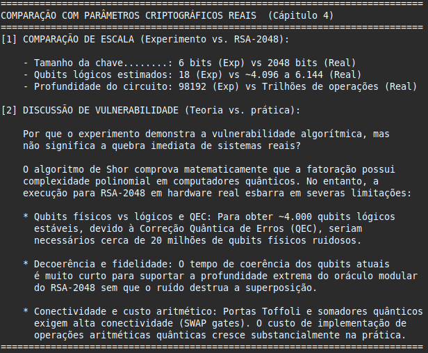
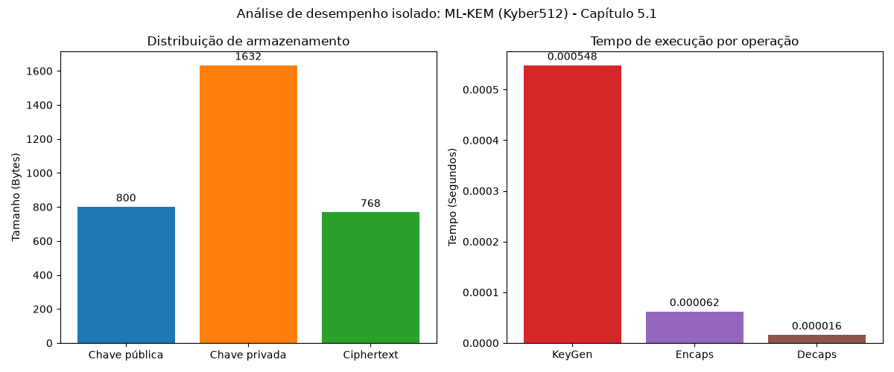
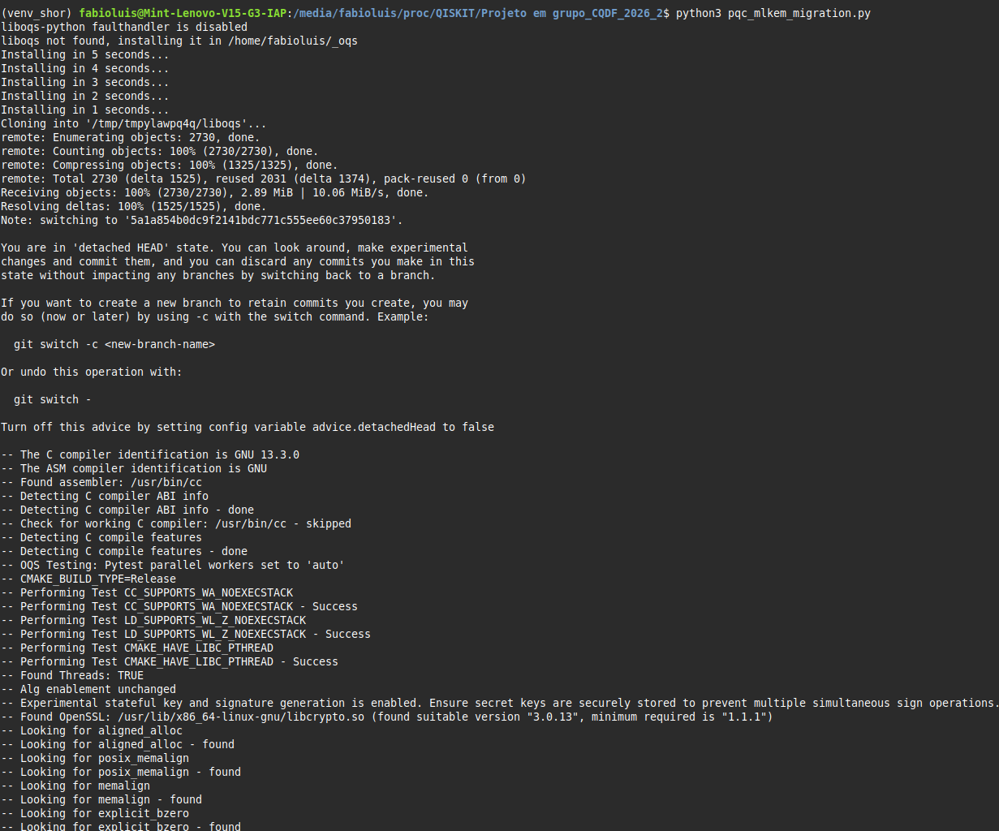
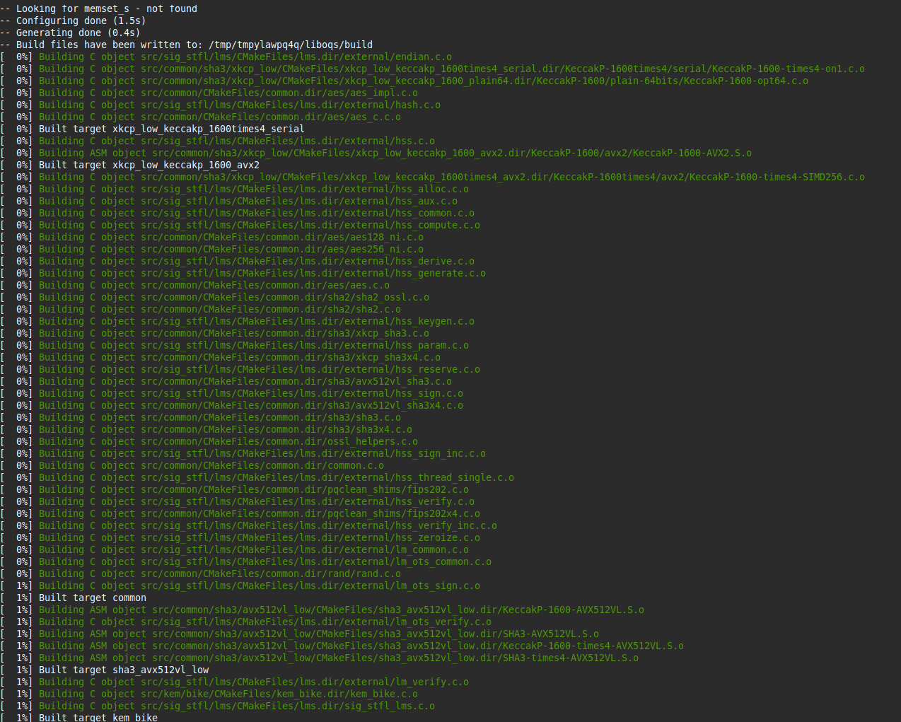
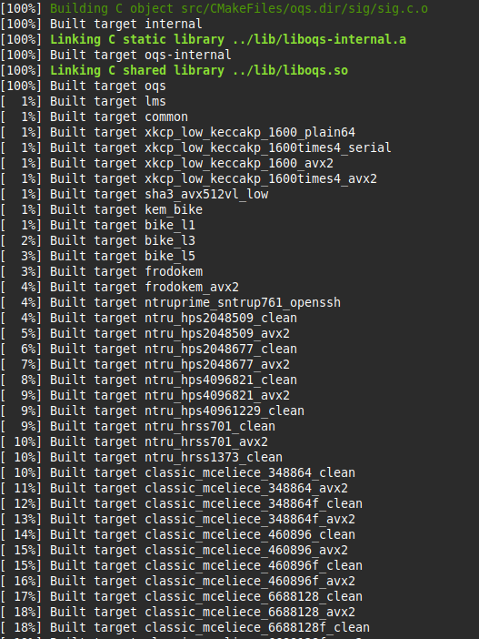
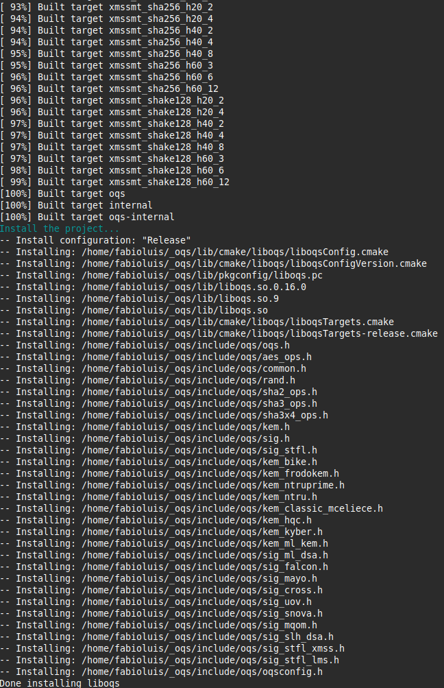
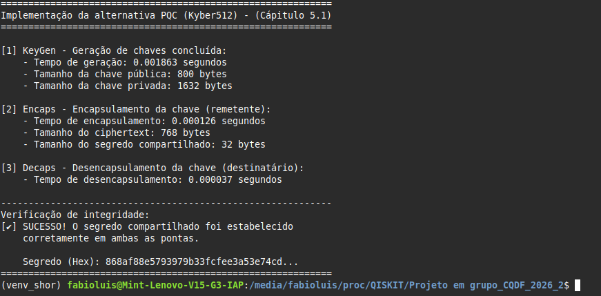
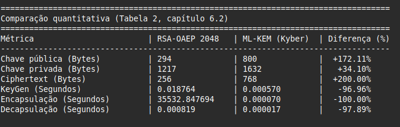
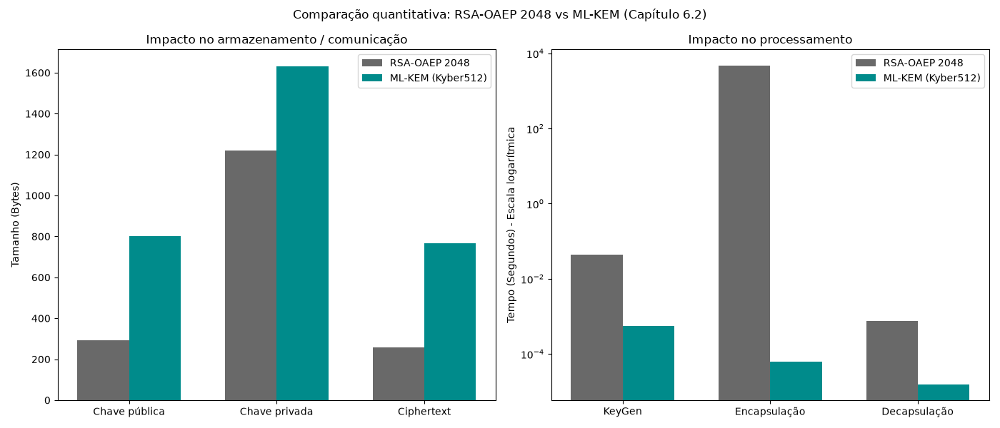
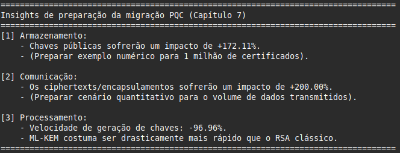

# Qiskit_shor_rsa_oaep

Algoritmo de Shor - Avaliação experimental: Criptografia RSA-OAEP

## 📌 Objetivos

- **Capítulo 1**: Relata o objetivo principal da atividade em grupo, que consiste em analisar experimentalmente a vulnerabilidade de algoritmos criptográficos baseados em **fatoração de inteiros** ou **logartimo discreto em curvas elípticas** diante de computadores quânticos capazes de executar o algoritmo de Shor.
- **Capítulo 2**: Por meio da tabela com os algoritmos a serem investigados, o grupo escolheu o item 7, da família do RSA, da variante RSA-OAEP e com o uso principal a criptografia RSA utilizando OAEP.
- **Capítulo 3**: Foi proposta a investigação do problema matemático que forneça a segurança algorítma por meio do desenvolvimento ou adaptação da implementação do **algoritmo de shor**.
- **Capítulo 3.1**: Demonstrar a quebra do problema matemático subjacente ($N=pq$) para a maior instância viável, recuperando parâmetros privados, documentando co e precisão estatística.
- **Capítulo 3.2**: Analisar o crescimento de complexidade escalando o experimento para pelo menos 4 tamanhos de instâncias, discutindo as limitações de recursos vs Tamanho da chave).
- Analisar experimentalmente a vulnerabilidade da fatoração de ($N=pq$) (problema subjacente ao RSA-OAEP) frente à computação quântica.
  Adaptações: Atendimento aos requisitos dos Capítulos 1 a 3.2 do documento de avaliação através daconstrução de uma versão reduzida e experimentalmente tratável do problema criptográficonstrução de Shor ao problema matemático subjacente e, posteriormente, propor uma estratégia de migração para um algoritmo de criptografia pós-quântica, ou Post-Quantum Cryptography (PQC).
  construção de práticos para a avaliação experimental da vulnerabilidade do algoritmo **RSA-OAEP** frente à computação quântica (Algoritmo de Shor), bem como o planejamento para migração Pós-Quântica (PQC) utilizando o ecossistema **Qiskit 1.x**.
- **Capítulo 4**: Comparar quantitativamente a maior instância experimental com um parâmetro real (RSA-2048), discutindo o gap tecnológico imposto por requisitos de qubits lógicos vs físicos, tempo de coerência, correção de erros (QEC) e profundidade de circuito.
- **Capítulo 5 e 5.1**: Visa propor e implementar uma estratégia de migração preservando a função criptográfica original. Substituição do RSA-OAEP (estabelecimento de chaves) pelo **ML-KEM (Kyber)**, realizando o fluxo experimental de `KeyGen -> Encaps -> Decaps` com a biblioteca Open Quantum Safe.
- **Capítulo 6 até 6.2**: Comparação quantitativa entre a solução original e o algoritmo PQC. Medição exata dos _bytes_ e _tempos de execução_ em Python, demonstrando a variação percentual ($\Delta$) em formato de tabela.
- **Capítulo 7**: Estruturação teórica do impacto da migração nos âmbitos de armazenamento, comunicação e processamento.

## 🛠️ Tecnologias Utilizadas

- **Sistema operacional:** Linux Mint 22.1 (Xia) / Ubuntu 24.04 LTS
- **Linguagem:** Python 3.12.3
- **Framework quântico:** Qiskit 1.X e Qiskit-Aer (Simulador)
- **Visualização:** Matplotlib
- **IDE:** Visual Studio Code

## 💻 Instalação e configuração

Devido às restrições de segurança do Python no Linux Mint 22.1 (PEP 668), é estritamente recomendado rodar o projeto dentro de um ambiente virtual.

**1. Instale as dependências de sistema:**

```bash
sudo apt update && sudo apt upgrade -y
sudo apt install python3-venv python3-pip -y git -y
```

**2. Crie e ative um ambiente virtual (evitando conflitos PEP 668):**

```bash
python3 -m venv venv_shor
```

**3. Instale as dependências essenciais do Qiskit 1.x:**

```bash
pip install qiskit qiskit-aer matplotlib numpy pylatexenc
```

**3.1. Instale as dependências do "C" para o linux (Capítulo 5 e 5.1)**

```bash
sudo apt update
sudo apt install build-essential cmake ninja-build libssl-dev -y
```

**3.2. Instale as dependências para extrair os tempos reais do RSA (Capítulo 6 e 6.2)**

```bash
pip install qiskit qiskit-aer matplotlib numpy pylatexenc liboqs-python cryptography
```

**4. Ative o ambiente virtual:**

```bash
source venv_shor/bin/activate
```

_(Nota: O ambiente `venv_shor` deve ser reativado sempre que abrir um novo terminal para rodar os scripts deste repositório. Durante sua utilização o nome do ambiente permanecerá no início da linha do terminal)._

## 📂 Estrutura do projeto

Este repositório poderá contém implementações de diferentes circuitos quânticos:

- **Clone o repositório (SSH):**
  ```bash
  git@github.com:Flgc/Qiskit_shor_rsa_oaep.git
  cd Projeto em grupo_CQDF_2026_2
  ```

**5. Execute o projeto:**

```bash
python3 shor_rsa_oaep.py

```

## 🧮 Algoritmo de Shor (Cápitulo 1 até 3.2)

Versão anterior, sem a comparação


## 🔬 Comparação com parâmetros reais (Capítulo 4)

Ao final da execução do algoritmo de Shor, o script gera automaticamente um relatório analítico no terminal. Ele contrasta as métricas do modelo em escala reduzida com as exigências matemáticas e de hardware para quebrar uma chave **RSA-2048**. O relatório aborda por que a vulnerabilidade algorítmica comprovada ainda esbarra em limitações físicas (decoerência, necessidade de milhões de qubits físicos para correção de erros e fidelidade de _gates_).



**6. Encerre o ambiente:**

Após terminar, finalize o ambiente virtual.

```bash
deactivate

```

## 🔀 Histograma da maior instância


## 🧩 Gráfico de crescimento do problema e recursos quânticos (Cápitulo 3.2)


## 🛡️ Migração Pós-Quântica (Capítulo 5 e 5.1)


Como o RSA-OAEP atua no estabelecimento e encapsulamento de chaves, a alternativa PQC implementada foi o **ML-KEM** (Kyber). O algoritmo obedece ao fluxo de geração de chaves (KeyGen), encapsulamento pelo remetente (Encaps) e desencapsulamento pelo destinatário (Decaps).

O desempenho isolado destas operações foi plotado graficamente para demonstrar o comportamento do Kyber512 em hardware atual:



_(Nota: Na primeira execução, o processo pode demorar alguns segundos adicionais devido à compilação em "C" da biblioteca open-quantum-safe)._







## 📊 Resultados do experimento PQC (capítulo 6 até 6.2)


A comparação quantitativa demonstra as variações de armazenamento e latência ao substituir o RSA clássico pelo ML-KEM. A saída no terminal exibe a diferença percentual ($\Delta$) exata:



Para fins de análise acadêmica, os resultados também são consolidados visualmente. Observa-se que, enquanto o ML-KEM exige chaves maiores (impacto de armazenamento), ele é ordens de grandeza mais rápido na geração de chaves (KeyGen) do que o RSA (impacto positivo no processamento):



## 💡 Insights de impacto (Capítulo 7)



## 🔧 Resolução de problemas comuns (Troubleshooting)


- **Erro `ModuleNotFoundError: No module named 'qiskit'`:** Isso ocorre se a pasta do projeto for renomeada ou movida. Ambientes virtuais quebram ao mudar de caminho. Solução: Apague a pasta `qenv`, crie-a novamente e reinstale as dependências.

- **Erro no método `get_counts`:** Certifique-se de grafar corretamente o método. O Qiskit não reconhece variações como `get_conts`.

- **Erro de importação na visualização:** No Qiskit moderno (1.x), a importação de gráficos ocorre via pacote principal (`from qiskit.visualization import plot_histogram`) e não pelo módulo `qiskit_aer`.

---

_Desenvolvido durante estudos de implementação de computação quântica para defesa cibernética._
