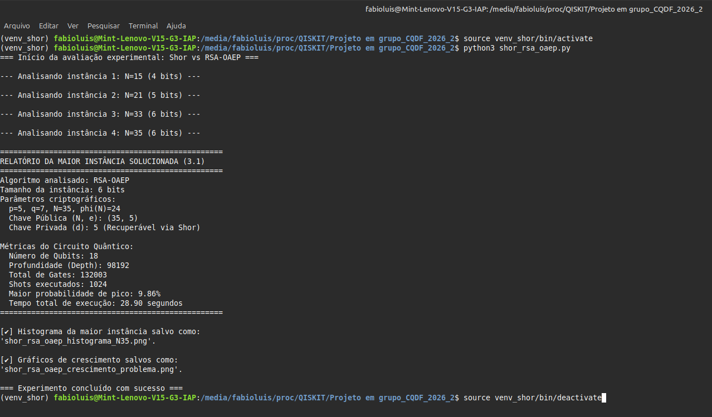
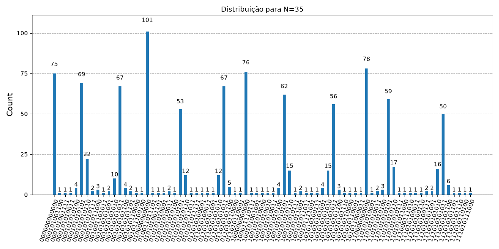
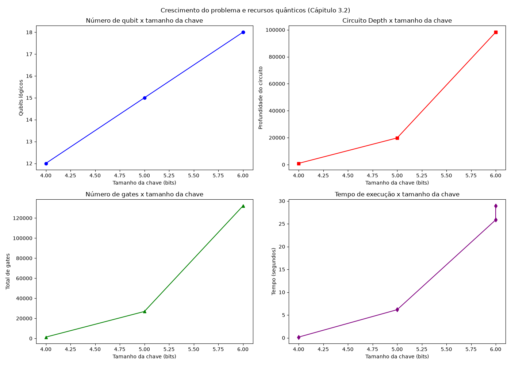

# Qiskit_shor_rsa_oaep

Algoritmo de Shor - Avaliação experimental: Criptografia RSA-OAEP

## 📌 Objetivos

- **Capítulo 3.1**: Demonstrar a quebra do problema matemático subjacente ($N=pq$) para a maior instância viável, recuperando parâmetros privados, documentando contagem de _gates_, _depth_, tempo e precisão estatística.
- **Capítulo 3.2**: Analisar o crescimento de complexidade escalando o experimento para pelo menos 4 tamanhos de instâncias, discutindo as limitações de recursos (Qubits vs Tamanho da chave, Tempo vs Tamanho da chave).
- Analisar experimentalmente a vulnerabilidade da fatoração de ($N=pq$) (problema subjacente ao RSA-OAEP) frente à computação quântica.
  Adaptações: Atendimento aos requisitos dos Capítulos 1 a 3.2 do documento de avaliação através daconstrução de uma versão reduzida e experimentalmente tratável do problema criptográficonstrução de Shor ao problema matemático subjacente e, posteriormente, propor uma estratégia de migração para um algoritmo de criptografia pós-quântica, ou Post-Quantum Cryptography (PQC).
  construção de práticos para a avaliação experimental da vulnerabilidade do algoritmo **RSA-OAEP** frente à computação quântica (Algoritmo de Shor), bem como o planejamento para migração Pós-Quântica (PQC) utilizando o ecossistema **Qiskit 1.x**.

## 🛠️ Tecnologias Utilizadas

- **Sistema operacional:** Linux Mint 22.1 (Xia) / Ubuntu 24.04 LTS
- **Linguagem:** Python 3.12.3
- **Framework quântico:** Qiskit 1.X e Qiskit-Aer (Simulador)
- **Visualização:** Matplotlib
- **IDE:** Visual Studio Code

## 💻 Instalação e configuração

Devido às restrições de segurança do Python no Linux Mint 22.1 (PEP 668), é estritamente recomendado rodar o projeto dentro de um ambiente virtual.

**1. Instale as dependências de sistema:**

```bash
sudo apt update && sudo apt upgrade -y
sudo apt install python3-venv python3-pip -y git -y
```

**2. Crie e ative um ambiente virtual (evitando conflitos PEP 668):**

```bash
python3 -m venv venv_shor
```

**3. Instale as dependências essenciais do Qiskit 1.x:**

```bash
pip install qiskit qiskit-aer matplotlib numpy pylatexenc
```

**4. Ative o ambiente virtual:**

```bash
source venv_shor/bin/activate
```

_(Nota: O ambiente `venv_shor` deve ser reativado sempre que abrir um novo terminal para rodar os scripts deste repositório. Durante sua utilização o nome do ambiente permanecerá no início da linha do terminal)._

## 📂 Estrutura do projeto

Este repositório poderá contém implementações de diferentes circuitos quânticos:

- **Clone o repositório (SSH):**
  ```bash
  git@github.com:Flgc/Qiskit_shor_rsa_oaep.git
  cd Projeto em grupo_CQDF_2026_2
  ```

**5. Execute o projeto:**

```bash
python3 shor_rsa_oaep.py

```

## 🧮 Algoritmo de Shor (Cápitulo 1 até 3.2)



**6. Encerre o ambiente:**

Após terminar, finalize o ambiente virtual.

```bash
deactivate

```

## 🔀 Histograma da maior instância



## 🧩 Gráfico de crescimento do problema e recursos quânticos (Cápitulo 3.2)



## 🛠️ Resolução de problemas comuns (Troubleshooting)

- **Erro `ModuleNotFoundError: No module named 'qiskit'`:** Isso ocorre se a pasta do projeto for renomeada ou movida. Ambientes virtuais quebram ao mudar de caminho. Solução: Apague a pasta `qenv`, crie-a novamente e reinstale as dependências.

- **Erro no método `get_counts`:** Certifique-se de grafar corretamente o método. O Qiskit não reconhece variações como `get_conts`.

- **Erro de importação na visualização:** No Qiskit moderno (1.x), a importação de gráficos ocorre via pacote principal (`from qiskit.visualization import plot_histogram`) e não pelo módulo `qiskit_aer`.

---

_Desenvolvido durante estudos de implementação de computação quântica para defesa cibernética._
